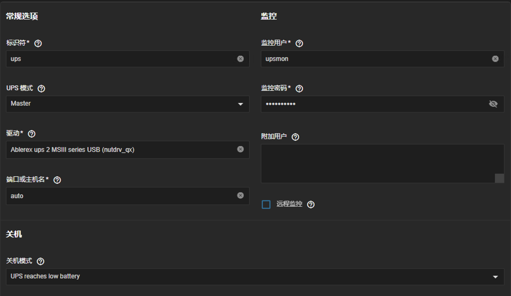

## 前言
回忆一下也是有几年了,最开始入坑NAS还是因为星际蜗牛,当时蜗牛矿渣大批量上市,一个机箱只要200左右,刚好当时有两块从笔记本还有PC淘汰下来的硬盘(2T),抱着折腾的心态直接入了两台,一台实验测试最佳实践,一台折腾最新特性.玩了有一年后,又奔着all in one的坑,自己配了一个性能强一点的.  
硬盘没插几块,也没什么存数据的刚需,但是这NAS家里都堆了三台了(苦笑).  
这三台NAS一开始都是用的黑群晖,黑群晖的一个优点应该是ui界面比较人性直观,适合小白使用;但是,因为是盗版系统,安全更新是一个大问题,大版本更新的每次跟进都要扒层皮.这对我这种喜欢跟进最新特性的人简直是折磨.另外硬件适配也是针对性的,我用的cpu和主板都较新,不知道哪里不兼容,硬盘不能启用休眠,一休眠就挂.虽然早就想迁移,但群晖的文件系统是私有格式,直接转移硬盘到另一个NAS或者别的系统都是没办法识别数据的.所以看里面已经住了那么多漂亮小姐姐的份上,我也就睁一眼闭一眼.  
但是这两天开始,那台自配的8盘位NAS开始掉盘了,看了上一篇文章的同学应该知道,我在上面搭建了rss服务,这下连新闻都不能看了.当作一个低成本家庭all in one小服务器用的NAS彻底失去了它的价值,狠狠心,里面的小姐姐都不要了!我要换家!!!  
注： 目前这套配置已经稳定运行两年了。TRUE NAS系统的升级也趋向稳定了，目前还是比较稳定的。--2024.5.17
<!--more-->
## 硬件说明
机箱 是 8盘位的万由机箱  
cpu 是 intel 10600T  
内存 是 2666MHz DDR4 16*2+8*2   
主板 是 技嘉小雕(B460M AORUS PRO)主板.  
因为主板上只有 6口SATA,所以又加了一块SATA3.0 4口拓展卡凑出来8口.  
电源 是 买机箱的时候送的益衡300W模块.  
整机功耗加硬盘100W左右,应该是妥妥的够了.  
如果都是长期不用的硬盘,做好系统休眠的话,待机功耗应该还可以降低到40~50w左右.  
## 关于RAID
NAS系统有一个重要的地方就是他的raid功能,但这更多的是一个企业功能,但是我个人的看法,家庭用户是没有必要使用raid的.  
一是增加存储成本,使用raid必然至少要占用一或多块体积最大的盘,这一块盘拿出来用于存放数据不好吗?  
二是riad5看似美好,但如果购买的是同一批次的磁盘,在同一时间损坏的概率很高,性价比最高的raid5恢复的计算需要对磁盘进行全盘读取,对家用磁盘来说这时候很有可能另一块也坏了.  
三是riad本身是为高可用服务的,如果你有24小时上线的业务,磁盘损坏导致的业务损失可能远远超出单块磁盘,这时候通过一些磁盘冗余,减小出问题的概率还是非常有必要的.但对于家庭用户,估计没什么不能断掉的服务在跑吧,可能屋里每过几个月都会不定时停一次电,这种高可用几乎是没啥必要的.  
四是增加维护复杂性,组raid以后,几块磁盘就绑定了,迁移的时候要一起迁移,有一块坏了,这些磁盘上的所有内容在进行校验恢复前都没办法继续使用.磁盘写入速度非常大比例的受到写入速度最慢的那块磁盘影响,对于使用多种大小和厂家的磁盘的家庭用户来说,组raid不一定会带来多大的写入上升,甚至还可能因为单块磁盘问题导致整个存储池速度严重变慢.组raid会减少数据丢失的概率,但会依照磁盘数量成倍的上升存储池出问题的概率.  
五是不方便扩展,组建raid通常是推荐一次到位,而且所有磁盘体积最好一致,但是对于可能nas上都是淘汰下来的像我这种半垃圾佬,组raid就会导致很大的空间浪费.    
六是SMART,现代的磁盘都已经支持SMART检测,快损坏的磁盘大部分都会现在SMART检测上出现预警,这时候做好迁移就好了.只要维护的好,没必要使用RAID来进行事后补偿.  
七是丢了又怎么样,重要数据做好多处备份后,不能恢复的数据可能还没一块硬盘值钱哈哈哈哈哈,比如一些虚拟机的历史快照之类的,大不了重新下载和配置喽.  
综合以上看法,我个人更倾向单盘单存储池的玩法.重要数据做好异地部分而不是使用raid.  
## NAS系统选择
nas常见的,大家了解最多的就是群晖和威联通了,这两家都是闭源系统.实际上用了这两年下来,他们的软件服务基本上也都没用上,都是我自己写的脚本,刚需其实就是docker,简单说装个ubuntu然后再装个docker就可以满足了.但怎么说,尊重未知,专业的nas系统自然有其优先的地方,有时候进去才会发现自己需求更方便和稳定的实现方式,这也是个人不断折腾的原因之一吧.  
除了功能外,系统也最好是开源的,磁盘最好是开源或者通用的格式,不然基本上就和这系统强绑定了,N年以后如果想要迁移就非常的麻烦,已经吃过一次亏自然不想第二次.  
在这种情况下,系统就是UNRaid和TrueNAS二选一了.unraid很适合家庭用户一把梭,折腾起来也很方便,raid方式也很有特点,单盘冗余备份,只占用空间最大的一块磁盘,后面可以非常简单的对磁盘池进行加减.拥有很多社区插件以及docker支持,但是论坛用户普遍反映unraid的读写速度是个问题,相比其他系统是要慢很多,没用nvme缓存的时候可能写入速度之后50~60MB/s.另外unraid是闭源系统,个人对其功能维护还有理念的持续性保持一定程度的怀疑.另外unraid大家普遍反映稳定性不佳,对被黑群晖的宕机恶心的这么久的我来说,系统的稳定性还是挺重要的.  
相对比的话TrueNAS是开源系统, 本身是为企业NAS服务的,稳定性较好,但缺点就是不直接支持docker的.不过我去官网的时候发现,它们出了一个truenas scale支持docker,而且去年10月已经release了.这不刚好就是一切成熟,一阵愉悦之下我决定就使用TrueNAS SCALE 作为之后几年的个人NAS存储系统.  
## TrueNas SCALE安装
不同的NAS系统的安装方式都是略有区别,比如群晖是在每个系统盘上都会安装一个系统,而TrueNAS要求配置单块32g 以上磁盘(HDD or SSD)当作系统盘.注意这块盘就只能做系统不能存数据.  
做盘比较简单,在官网下载好TrueNAS镜像之后,可以使用balenaEtcher刻录到u盘上,然后插入NAS中,选择U盘启动即可进入安装界面.注意就是系统盘不能再存放数据了.以及因为会不断的写入日志到系统盘,所以官方不再推荐使用一般的U盘安装系统,它们本不是用于频繁写入的,这么玩的寿命通常只能撑半年到一年左右.  
但是sata口我刚好比较缺,本身8盘就已经用了主板上4个口加上一个4口的sata拓展卡.还有2个m.2接口,还等待以后升级配置的时候用970填上.所以,这里选择使用一个64GB的固态u盘作为系统盘,寿命应该用个3~4年不成问题吧.  
进入安装界面后等进度条走完,系统就安装好了,TrueNAS SCALE 基于debain,熟悉的朋友对TrueNAS SCALE的命令行应该也是很熟悉.所有的磁盘都挂载在`/mnt` 目录下.  
另外有一点要注意的是,基本上不通过GUI的操作都会在系统重启后被还原.这和TrueNAS的定位有关,基本上它把自己当作一个纯粹的企业NAS存储方案提供商,所以不希望用户做太多的自定义操作引入奇奇怪怪的问题.这里拿苹果当例子应该就很好理解了.刚刚的系统盘不能安装数据也是这种理念的体现,要么尊重最佳实践,要么去使用别的系统折腾吧.  
## zfs 介绍
zfs基本上被大家叫做第三代文件系统,简单来说,第一代就是读写,第二代就是加入了日志,减少突然宕机时对系统的危害,第三代代表就是zfs了,加入了写时复制(COW),定时快照,raid,自动纠错,自动去重,自动压缩,自动加密等特性. 但是读写速度的话,相比第二代如ext4并没有什么提升,不如说如果关闭zfs的arc缓存后,写入速度就只有ext4的一半.  
## 功能配置
### sdd auto trim
注意trim仅仅针对ssd  
### scrub 配置
### 定时快照设置
### docker-compose 安装
安装好之后就是把之前黑群晖上的服务再重新在TrueNAS上搭建起来.索性个人使用的服务基本上都是通过docker-compose来启动管理的.那接下只要先装好docker-compose就好了.  
但装好才发现TrueNAS内置了docker,但是却不直接支持docker compsoe,因为TrueNAS使用k3s进行容器编排,作为同样的容器编排工具,docker compose自然与之冲突.  
去论坛上可以看到与此相关的好多争论,更专业的运维人员希望使用k8s完成更完整的编排,而普通用户又希望使用docker-compose进行简单的部署,但不管如何,k3s不是一个大多数人能接受的方案.  
在较早的帖子里,大家通常是通过先新建一个虚拟机,然后再在虚拟机里安装docker的方式来解决,不过我们选择TrueNAS SCALE本来就是因为其内置的docker,再新建虚拟机真是非常的不优雅.
好在社区倒是提出了一个更好的方式--通过docker in docker技术,使得我们可以建立一个docker-compose容器,然后在该容器内使用docker-compsoe去运行其他容器,这样就能和k3s的编排隔离开来.而且使用中也暂时没发现什么坑.可以说非常完美了.  
首先添加社区源,这里po一下社区源的文档,上面有很多第三方包,不过我们在意的其实只有docker-compose.一键安装好后,进入命令行运行`docker compose`命令即可发现现在docker-compose已经成功安装在容器内了,然后就按平常的方式启动docker-compose即可.

### SMB共享
#### 共享额度限制
#### ACL权限
同一个文件夹如果想要共享给多个用户的话就要设置ACL权限了.
### MAC TimeMachine设置
配置mac timemachine的方式比较复杂一些,首先

## UPS配置
家里面的频繁断电还是很伤硬盘的，所以使用一段时间后，还是加上了UPS配置。  
UPS主要有两个作用  
一是在短时间断电或者电压波动的时候保持电量平稳，比如半个小时内的多次开断电，那不仅对硬盘的损伤很可观的，而且每次启动系统都要重启启动nas上面跑的各种服务，还是挺麻烦的。  
二是在长时间断电，UPS电池供电不足的时候，通知NAS主动关机来保护硬盘。  

### UPS选型
目前NAS的功率在100w左右。因为家里面的断电来电的速度还挺快，根据我这两年的经验，大部分断电，比如忘交电费，电表跳闸等，一个小时内都可以恢复，如果超过一个小时不好的，那就可能往往要等好几个小时，所以希望UPS的电池能至少持续供电一个小时吧。
论坛上很多人推荐山特的`TG-BOX850`,电池容量是`12V/7AH`，在断电的情况下100w输出可以坚持24分钟，价格接近500，优点是群晖官方支持，如果是群晖系统插上去就可以识别UPS电量，并在低电量的时候自动关机。  
但可惜，我是TRUENAS，作为对比 山克的`SK2000`的电池容量是`12V/9AH*2`在100w输出的情况下,如果效率和`TG-BOX850`一致，那么可以坚持`12V*9AH*2/100W*60m*(24m/(12V*7AH/100W*60m))=61.7`分钟，和850的价格差不多，但是持续时间是850的2倍还多一点，但缺点就是说明页上没有说明如何低电量的时候主动通知nas关机，所以这个功能的实现，大概率要自己折腾。  
但大不了到时候使用ping某个不在ups供电的设备是否在线这个方式来判断是不是断电了，如果持续断电一个半小时，那么就主动给nas关机。    
这个方案的问题在于需要保证ping的设备的稳定，不要在没断电的时候设备离线了，这样nas就自动误关机了。以及工作的负载可能临时高于100w，加上几年后电源蓄电量可能不足标称值，导致提前断电。但不管怎么算，持续的时间都要长于24分钟哈哈哈。  
所以权衡之下，还是购买了`SK2000`。  
另外可以检查nas电源的`hold up time`，一般来说，切换时间在10ms以内都是可以承受不会关机的范围。
### UPS配置
买回来后，惊喜的发现`SK2000`后面有一个usb接口，于是询问客服后得知，其实可以通过一个叫[ViewPower](https://www.power-software-download.com/viewpower-cn.html)的软件链接电脑，然后就可以在电脑上查看UPS的状态。
既然有通讯接口，那看起来有机会链接到NAS上，阅读Truenas Scale文档的ups部分之后，发现官方提供了一个支持的[品牌列表](https://networkupstools.org/stable-hcl.html)，在上面搜索了一番后，我发现在[nutdrv_qx](https://networkupstools.org/docs/man/nutdrv_qx.html)驱动的文档上写着这么一段话：
>The nutdrv_qx driver is known to work with various UPSes from Armac, Blazer, Energy Sistem, Fenton Technologies, General Electric, Hunnox, Masterguard, Mustek, Powercool, Voltronic Power, SKE (rebranded by many, many - have I said many? - others…
>
>Long story short: if your UPS came with a software called Viewpower, chances are high that it works with this driver with one of the voltronic* protocols or with the mecer one), and many others.
可以看到上面说支持Viewpower的UPS通常这个驱动也工作，看来不需要我们在做什么破解工作了。
那直接在Truenas Scale 的 系统设置->服务->ups 里进行配置就可以了。配置如下：  
  
里面的驱动是随便找了一个使用nutdrv_qx驱动的品牌，应该都可以支持。  
配置好之后，启动ups服务，然后在shell中输入`upsc ups`命令就可以查看到ups的状态信息，以及驱动信息如下：
```shell
➜  ~ upsc ups
Init SSL without certificate database
battery.voltage: 27.18
device.type: ups
driver.name: nutdrv_qx
driver.parameter.pollfreq: 30
driver.parameter.pollinterval: 2
driver.parameter.port: auto
driver.parameter.synchronous: auto
driver.version: 2.8.0
driver.version.data: Voltronic-QS-Hex 0.10
driver.version.internal: 0.32
driver.version.usb: libusb-1.0.26 (API: 0x1000109)
input.voltage: 226.6
output.frequency: 50.9
output.voltage: 226.6
ups.beeper.status: enabled
ups.delay.shutdown: 30
ups.delay.start: 180
ups.firmware.aux: PM-P
ups.load: 7
ups.productid: 5161
ups.status: OL
ups.type: offline / line interactive
ups.vendorid: 0665
```
其中，`ups.status`指示当前的UPS状态，OL代表在线（online）
不过信息中只有电压，没有显示电压百分比，查询文档可以知道，因为不同电池规格不一样，所以我们还需要手动设定ups电池的最大电压（充电到100%时候的电压）和最小电压（降电到0%时候的电压）。
山克的服务态度非常的好，直接询问客服，他就将技术人员的电话直接给我了。通过询问技术人员，得知最高电压27v，最低一般不会低于22v。
所以我们在附加选项（ups.conf）里填入如下参数:
```
default.battery.voltage.high=27
default.battery.voltage.low=22
```
再次在shell中输入`upsc ups`：
```shell
➜  ~ upsc ups
Init SSL without certificate database
battery.charge: 100
battery.voltage: 27.18
battery.voltage.high: 27
battery.voltage.low: 22
device.type: ups
driver.name: nutdrv_qx
driver.parameter.pollfreq: 30
driver.parameter.pollinterval: 2
driver.parameter.port: auto
driver.parameter.synchronous: auto
driver.version: 2.8.0
driver.version.data: Voltronic-QS-Hex 0.10
driver.version.internal: 0.32
driver.version.usb: libusb-1.0.26 (API: 0x1000109)
input.voltage: 226.6
output.frequency: 50.9
output.voltage: 226.6
ups.beeper.status: enabled
ups.delay.shutdown: 30
ups.delay.start: 180
ups.firmware.aux: PM-P
ups.load: 7
ups.productid: 5161
ups.status: OL
ups.type: offline / line interactive
ups.vendorid: 0665
```
可以看到`battery.charge: 100`出现了，代表了目前的电量是100%。

### UPS测试
断电，nas正常工作，没有重启，ups电源风扇开始狂转，蜂鸣器发出的响声和风扇几乎持平哈哈。 
进入shell输入`upsc ups`检查ups状态，可以看到`ups.status: OB`,说明进入电源供电状态。  
放电一个小时后，显示`battery.charge: 12`,`battery.voltage: 22.59`，但我们知道带载情况下，显示的电压其实是偏低的，所以实际电量应该还要比显示的多一些。不过能坚持一个小时已经满足要求了。  
恢复供电，重新检查ups供电，显示`ups.status: OL`恢复到正常状态。顺便说下`LB`代表电量过低。这个时候就会通知nas关机。（但是并没有测试）

## NAS优化
### NVME磁盘的用途
众所周知啊,企业盘虽然容量很大,但是读写很吵,而且家用小服务器会常驻一些服务,比如 bt下载 homeassistant rss等等,这些服务会频繁的小幅度读写磁盘,如果数据库放在hdd企业盘里,那炒豆子的声音就断不了,而且nvme磁盘的小文件随机读写速度要比hdd磁盘高几个量级,从此考虑,常用的热数据,服务等等都放在nvme盘里,hdd盘放一些不经常读取又占空间的大文件,比如电影啊等等.
### 硬盘休眠和电源设置的说明
启动时nas的待机功率在70w,还是比较高的,拔掉8块hdd硬盘后的功率是25w,所以磁盘大概耗掉了45w,还是很高的.那家用存储其实硬盘休眠就非常必要了.
一块企业盘的耗电大概是5~8w,按5w算8块就是40w,一个月就是40*24*30/1000=28.8度.商用电的价格是1度/元,大概一年就是350块钱...浪费的电力也是很可观了,这多余的电费钱都能买个百度云盘的年费了.
企业盘一般都是不推荐待机的,因为频繁启停会比较伤硬盘,另外企业盘本身也是为24小时运转制作的,所以一直运转的状态下反而要比待机的状态寿命要更有保证.
如果某块磁盘没有热数据要存，比如不挂pt什么的,那就可以设置上硬盘休眠。
首先进到shell界面, ‘disk stat'命令可以获取硬盘信息.命名的话hdd磁盘一般是从 sda开头,sdb,sdc这样。

### arc
zfs对arc的需求很大,在普通的linux系统上,zfs_arc_max为0,代表最大arc占用是总内存的一半,比如48G的内存就会占用24G用作arc,剩下24G用作系统和应用服务.
不过如果你没有那么多docker要跑的话,鉴于arc对zfs系统的巨大作用,我建议将zfs_arc_max设置为总内存的75%.比如总内存48G,zfs_arc_max就设为35G,也就是37580963840
设置方法就是在system setting -> Advanced -> Init/Shutdown Scripts -> add
type是 “command” ,command 是 “echo 37580963840 >> /sys/module/zfs/parameters/zfs_arc_max” ,when 是 "pre init"


### l2arc
zfs还有一个l2arc,用途就是将一个ssd用于接受arc溢出的数据,这部分数据当再次使用时就直接从ssd中读取到arc.
实际使用中l2arc的效果非常不明显,这是因为arc通常的命中率就可以达到99%,l2arc的命中率只有个位数,这代表只有arc未命中的部分也就是那百分之一中只有百分之几的数据可以再从l2arc的数据中命中,这效果非常的差.
所以通常的建议是增加arc,也就是总内存的大小到极限,当实在无法增加内存大小,而arc的命中率又比较低(80%)的时候再考虑增加l2arc,不然甚至可能会带来拖慢速度的副作用.

## 问题
### 分层存储
其实我想要一种分层缓存机制,就是常用的数据在ssd盘里,不常用的会逐渐落到hdd盘上(定时以及定条件触发),这样一是读写速度会大幅加快,而是企业盘的炒豆子声音也会减少,因为主要读写都是ssd,hdd盘就是偶尔会连读一下而已.目前还没找到好的家用级别的实现方式.

### 磁盘每5分钟读取一次
使用netdata查看历史数据的时候发现磁盘被每五分钟读取一次,不管有没有新建存储池都一样,如图:

这问题很奇怪,SMART的检测时间是30minutes,所以应该不是SMART检测的问题.
不过这个倒没有导致硬盘被频繁唤醒,所以就不管了.
### 安装NVME之后开始每几小时宕机一次
在安装了一块从京东购买的970 evo plus 1T后.突然出现系统开始每几小时宕机一次,在系统里也查不到问题日志.鉴于我把系统数据收集池也移到了该块磁盘上,所以判断问题应该是这块磁盘上.所以,拆机检查发现,这个nvme的长度是插在了11cm的m.2槽上,但是没有用m2螺丝固定,应该是因为此导致了打滑或者信号传输error.  
重新插拔之后,正在观察问题,如果问题依旧复现,更换系统数据收集池到其他磁盘上,看是否能收到错误日志.    
以及从淘宝下单了一个m2固定螺丝,等待送达之后安装上再看看.  
--后记,果然是固定的问题,装上螺丝后就再也没重启过了,已经稳定运行几个月了.
## 后记
也是所谓的折腾,真要说的话,家用没有那么大的带宽,机器运行的费用其实也打不平云服务器,比如这台每月电费是30块,8块磁盘大概有1.5w了,主机cpu主板机箱内存应该是6000左右,有2w我可以在阿里云上买一台超高性能的云计算机器了,稳定和可靠程度要吊打家用服务器. 不过,也就是cpu性能了,去查了下10t存储的阿里云三年要7w,还是高性能实例,还没有算上带宽费用,家庭用云服务器还不是那么可靠hhh...不过希望随着带宽的发展,以后都像企业那样,个人只用瘦终端,然后计算上云,用多少花多少钱,这样就能省很多钱,而且减少很多浪费,而且也可以随时更换硬件升级.
不致于像现在这样这么折腾.